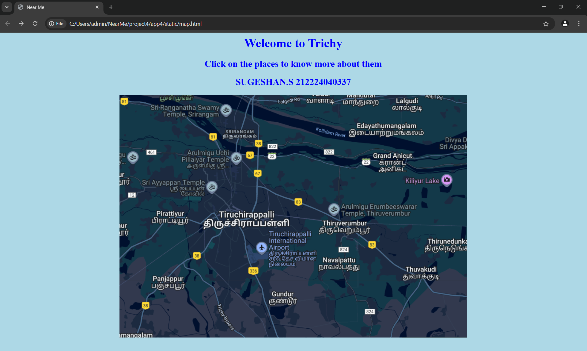
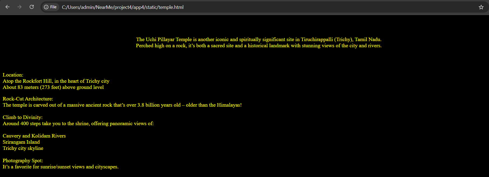
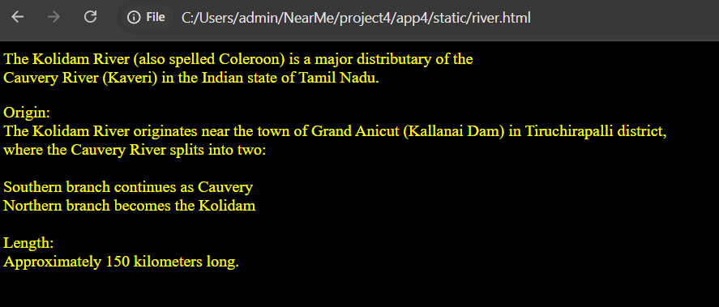
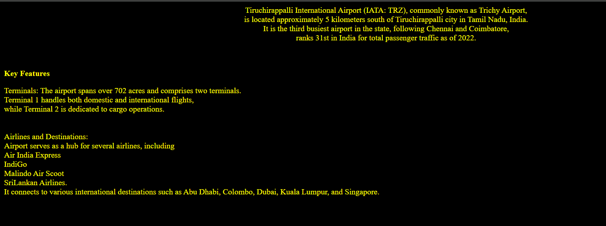

# Ex04 Places Around Me
## Date: 22.04.2025
## Name: SUGESHAN
## Reg.NO: 212224040337

## AIM
To develop a website to display details about the places around my house.

## DESIGN STEPS

### STEP 1
Create a Django admin interface.

### STEP 2
Download your city map from Google.

### STEP 3
Using ```<map>``` tag name the map.

### STEP 4
Create clickable regions in the image using ```<area>``` tag.

### STEP 5
Write HTML programs for all the regions identified.

### STEP 6
Execute the programs and publish them.

## CODE
map.html
```
<head>
    <title>Near Me</title>
</head>
<body style="color: blue; background-color: lightblue;">
    <center>
        <h1><b>Welcome to Trichy</b></h1>
        <h2><b>Click on the places to know more about them</b></h2>
    <h2><b>SUGESHAN.S 212224040337</b></h2>
    <center>
        

<map name="image-map">
    <area target="" alt="Airport" title="Airport" href="airport.html" coords="341,320,566,471" shape="rect">
    <area target="" alt="Temple" title="Temple" href="temple.html" coords="159,116,324,223" shape="rect">
    <area target="" alt="Sri Ranganatha Swamy temple" title="Sri Ranganatha Swamy temple" href="srirangam.html" coords="66,4,293,103" shape="rect">
    <area target="" alt="Kolidam River" title="Kolidam River" href="river.html" coords="327,14,319,38,561,119,684,130,777,161,897,145,901,105,817,129,630,97" shape="poly">
    <area target="" alt="The Grand Anicut" title="The Grand Anicut" href="anicut.html" coords="613,142,780,249" shape="rect">
</map>
    </center>
        

</body>
```
airport.html
```
<head>
    <title>Airport</title>
</head>
<body style="background-color: black; color: yellow;">
<center>    <p>
    Tiruchirappalli International Airport (IATA: TRZ), 
    commonly known as Trichy Airport,<br> is located approximately
     5 kilometers south of Tiruchirappalli city in Tamil Nadu, 
     India.<br>
      It is the third busiest airport in the state, 
     following Chennai and Coimbatore, <br> ranks 31st in India 
     for total passenger traffic as of 2022.
</p>
</center>

<br>
<br>
<b>Key Features</b> <br>
<p>
    Terminals: The airport spans over 702 acres and comprises two terminals. <br>
    Terminal 1 handles both domestic and international flights, <br>
    while Terminal 2 is dedicated to cargo operations.<br>
    <br>
    <br>
    Airlines and Destinations: <br>
     Airport serves as a hub for several airlines, including
    <br>
     Air India Express<br>
     IndiGo<br>
     Malindo Air Scoot<br>
     SriLankan Airlines. 
     <br>It connects to various international destinations such as 
    Abu Dhabi, Colombo, Dubai, Kuala Lumpur, and Singapore. 
</p>
</body>
```
anicut.html
```
<head>
    <title>
        The Great Anicut
    </title>
</head>
<body style="background-color: black; color: yellow;">
    <center>
        <p>
        Built by: Chola King Karikalan <br>
        Era: Around 2nd century CE <br>
        Purpose: Irrigation — to divert water from the Cauvery River to the fertile delta regions of Tamil Nadu<br>
    </p>
    
</center>
    <br>
    <p>
        Material: Made of unhewn stone (granite blocks)
<br>
<br>
Length: Around 329 meters <br>
<br>
Height: About 5.4 meters<br>
<br>
Design:<br>
It’s a diversion dam, not meant to store water but to regulate and divert it<br>
Water is diverted into canals leading to the delta plains — some of the most fertile in India<br>


    </p>

</body>
```
river.html
```
<head>
    <title>
        Kolidam River
    </title>
</head>
<body style="background-color: black; color:yellow ;">
    <p>
        The Kolidam River (also spelled Coleroon) is a major distributary of the <br>
         Cauvery River (Kaveri) in the Indian state of Tamil Nadu.
    </p>
    <p>
        Origin:<br>
               The Kolidam River originates near the town of Grand Anicut (Kallanai Dam) in Tiruchirapalli district, <br>
                where the Cauvery River splits into two:<br>
               <br>
                Southern branch continues as Cauvery<br>
               Northern branch becomes the Kolidam<br>

        <br>
               Length: <br>
               Approximately 150 kilometers long.
    </p>

</body>
```
srirangam.html
```
<head>
    <title>
        srirangam
    </title>
</head>
<body style="background-color: black; color: yellow;">
    <center>
<p>
    The Sri Ranganatha Swamy Temple in Srirangam is one of the most magnificent temples in India — rich in architecture, spirituality, and history. 
</p>
<br>
<br>
<p>
    The main deity is Lord Ranganatha, a reclining form of Lord Vishnu on the serpent Adisesha. <br>

The temple is considered the first and foremost of the 108 Divya Desams (sacred Vishnu temples praised in Tamil Vaishnavite hymns). <br>
</p>
<p>
    One of the largest functioning Hindu temples in the world.
<br>
Covers 156 acres with 7 concentric enclosures (prakarams) and 21 gopurams (tower gateways).
<br>
The Rajagopuram (main tower) is 72 meters tall – one of the tallest temple towers in Asia.<br>
</p>
</center>
</body>
```
temple.html
```
<head>
    <title>Temple</title>
</head>
<body style="background-color: black; color: yellow;">
    <center>
    <p>
        <br>
        <br>
        <br>

        The Uchi Pillayar Temple is another iconic and spiritually significant site in Tiruchirappalli (Trichy), Tamil Nadu.<br>
        Perched high on a rock, it’s both a sacred site and a historical landmark with stunning views of the city and rivers.
    </p>
    <br>
    <br>
    <p>
    </center>
     Location: <br>       Atop the Rockfort Hill, in the heart of Trichy city
<br>
        About 83 meters (273 feet) above ground level

<br>
    </p>
    <p>
        Rock-Cut Architecture: <br>
The temple is carved out of a massive ancient rock that’s over 3.8 billion years old – older than the Himalayas!
<br>
<br>
Climb to Divinity:<br>
Around 400 steps take you to the shrine, offering panoramic views of:
<br>
<br>
Cauvery and Kolidam Rivers
<br>
Srirangam Island
<br>
Trichy city skyline
<br>
<br>
    
Photography Spot:<br>
It’s a favorite for sunrise/sunset views and cityscapes.<br>
    </p>
</body>
```

## OUTPUT











## RESULT
The program for implementing image maps using HTML is executed successfully.
